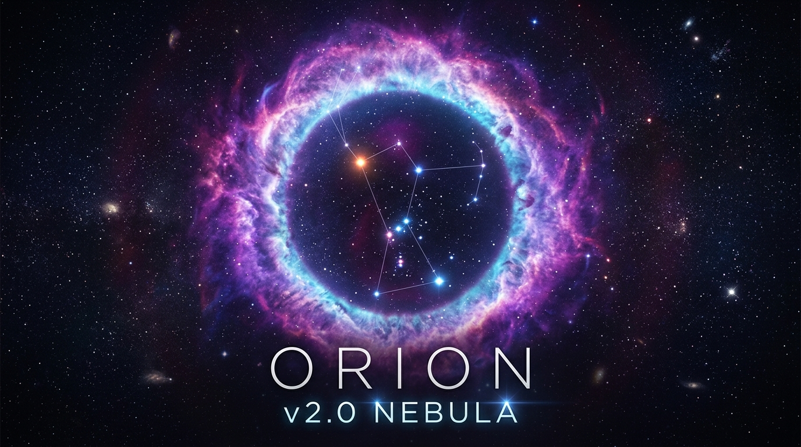

<p align="center">
  
</p>

# 🌌 Orion System × Nebula Model (v2.0)
### High-Performance Desktop Automation Substrate & Cognitive Chrome Agent Society

[](LICENSE)
[](https://microsoft.com/windows)
[](https://python.org)
[](#-testing)

---

## 📖 Overview

**Orion System × Nebula Model** is a hybrid autonomous desktop automation framework designed for Windows. It couples a low-level, high-speed OS substrate (**Orion**) with a collaborative multi-agent reasoning layer (**Nebula**).

* **Orion (The Operating System Layer)**: Manages low-level Win32 window processes, native Google Chrome execution, continuous visual perception, and system-level self-healing.
* **Nebula (The Cognitive Model Layer)**: A 5-agent society that decomposes natural language goals, plans execution steps, controls hardened Playwright browser sessions, and performs closed-loop visual/DOM verification.

---

## 🏛️ System Architecture

```
 ┌────────────────────────────────────────────────────────────────────────┐
 │                      NEBULA (The Cognitive Model)                      │
 │    Commander Nebula │ Chrome Executor │ Perception Inspector           │
 │               Studio Narrator │ Verifier Critic                        │
 └───────────────────────────────────┬────────────────────────────────────┘
                                     │ Intent & Milestone Dispatch
 ┌───────────────────────────────────▼────────────────────────────────────┐
 │                       ORION (The Operating System)                     │
 │  Win32 Automation │ Chrome Driver │ Continuous Perception (6 FPS)      │
 │  Self-Healing Watchdog │ Studio Audio I/O (OneCore SAPI)               │
 └────────────────────────────────────────────────────────────────────────┘
```

---

## 🔄 How It Works

Every user task flows through a closed-loop 5-stage pipeline:

```
User Command (Text or Voice)
        │
        ▼
┌─────────────────────────────────────────────┐
│  1. INPUT UNDERSTANDING                     │
│  Normalize text → Fix phonetic typos        │
│  → Resolve conversational context           │
│  → Confidence gate (auto-run / clarify)     │
└─────────────────────┬───────────────────────┘
                      │ Typed Plan (Intent + Steps)
                      ▼
┌─────────────────────────────────────────────┐
│  2. REASONING & PLANNING (Commander Nebula) │
│  Gemini AI decomposition → validated schema │
│  Built-in deterministic local fallback      │
└─────────────────────┬───────────────────────┘
                      │
                      ▼
┌─────────────────────────────────────────────┐
│  3. EXECUTION (Chrome Executor)             │
│  Playwright browser automation              │
│  Domain allow-lists & action guards         │
└─────────────────────┬───────────────────────┘
                      │
                      ▼
┌─────────────────────────────────────────────┐
│  4. VERIFICATION (Perception Inspector)     │
│  DOM error / modal / login-wall detection   │
│  Perceptual visual hash (pHash) diff        │
│  Self-heals on failure or uncertain verdict │
└─────────────────────┬───────────────────────┘
                      │
                      ▼
┌─────────────────────────────────────────────┐
│  5. FEEDBACK & AUDIT (Studio Narrator)      │
│  Text-to-speech announcement                │
│  Structured JSON audit log + metrics        │
└─────────────────────────────────────────────┘
```

---

## ⚡ Key Capabilities

* **5-Agent Society**: Specialized roles for planning, execution, inspection, narration, and verification.
* **Closed-Loop Verification**: Perceptual visual diffing and DOM signal inspection verify that actions took effect and automatically trigger self-healing if a stall, error, or modal occurs.
* **Hardened Browser Engine**: Anti-bot stealth (`navigator.webdriver` set to false), automated cookie consent dismissal (OneTrust, Cookiebot), and isolated worker thread execution.
* **Input Pipeline**: Robust natural language processing with phonetic typo correction, bilingual support, conversational reference resolution, and confidence gating.
* **Security Guardrails**: Action allow-lists, domain restrictions, and sensitive action interception before execution.
* **Zero-Distraction / Zero-Key Fallback**: Runs reliably out of the box with deterministic local parsing even without external API keys.

---

## 📦 Installation & Setup

### Prerequisites
* **OS**: Windows 10 or Windows 11
* **Python**: 3.10 or higher
* **Google Chrome**: Installed and available in PATH or default Windows installation path

### Setup Steps

```powershell
# 1. Clone repository
git clone https://github.com/nividharan/Orion--V2.0-Nebula.git
cd Orion--V2.0-Nebula

# 2. Create and activate a virtual environment (recommended)
python -m venv .venv
.\.venv\Scripts\activate

# 3. Install dependencies
pip install -r requirements.txt

# 4. Install Playwright browser binaries
python -m playwright install chromium

# 5. (Optional) Set Gemini API Key for AI planning
# If omitted, Orion automatically uses the built-in deterministic local parser
$env:GEMINI_API_KEY="your-gemini-api-key"
```

---

## 🚀 Quick Start

Minimal commands to verify and run the system:

```powershell
# 1. System Diagnostics & Health Check
python orion_autogen.py doctor

# 2. Autonomous Task Execution (Nebula Agent Society)
python orion_autogen.py "play lofi beats on youtube"

# 3. Direct Browser Navigation (Orion Fast Path)
python desktop_controller.py browse "https://github.com"

# 4. Voice Feedback (Studio Speech Engine)
python desktop_controller.py speak "All systems operational"
```

---

## 📁 Project Structure

```
Orion--V2.0-Nebula/
├── orion_autogen.py          # Main 5-agent society entry point (Nebula CLI)
├── desktop_controller.py     # Orion system layer CLI (Orion OS primitives)
├── nebula_brain.py           # NebulaBrain — AI planning and local parser fallback
├── schemas.py                # Typed Plan, Step, ActionType, IntentType definitions
├── input_pipeline.py         # 8-stage input understanding & confidence gating
├── api_client.py             # YouTube Data API v3 & fallback scraper client
├── config.py                 # Paths, atomic writes, cache management, safety guards
├── observability.py          # Structured JSON logging, audit metrics, regression runner
│
├── web_engine/               # Hardened Playwright engine (stealth, consent, locators)
├── verify/                   # DOM health checks, modal detection, visual diff verification
├── resolvers/                # Media search resolver with relevance scoring & caching
├── tools/                    # Agent tools and SocietyCoordinator
├── tests/                    # Complete regression test suite (12 modules, 293 tests)
├── legacy/                   # Archived Win32 desktop modules
└── logs/                     # Structured JSON audit logs per task
```

---

## 🧪 Testing

The repository includes a comprehensive regression test suite covering schemas, brain planning, input normalization, browser engine, resolvers, page verification, and agent coordination:

```powershell
# Run the full test suite
python -m pytest

# Run with verbose output
python -m pytest -v
```

All **293 tests** pass with zero critical errors.

---

## 📜 License

Distributed under the **MIT License**. See [LICENSE](LICENSE) for details.
